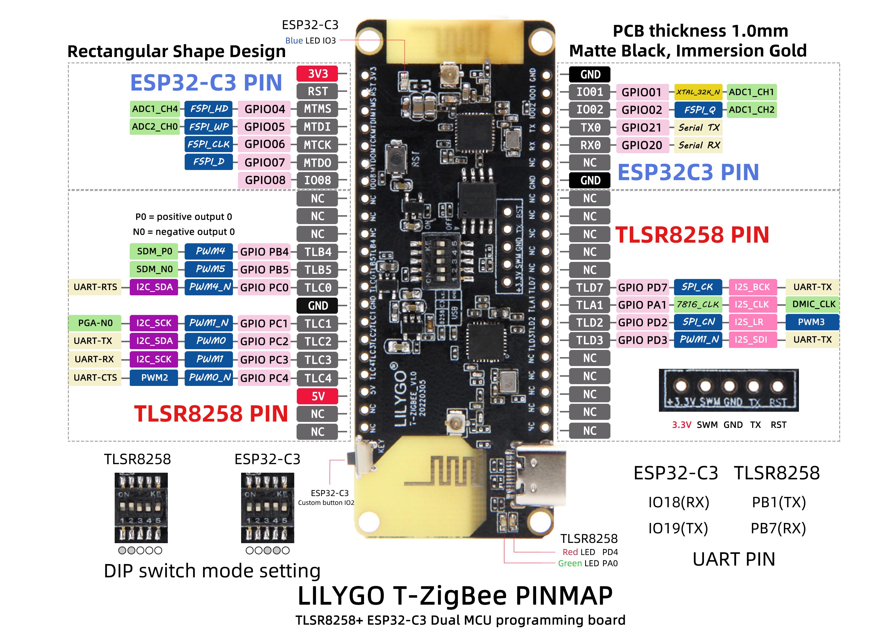
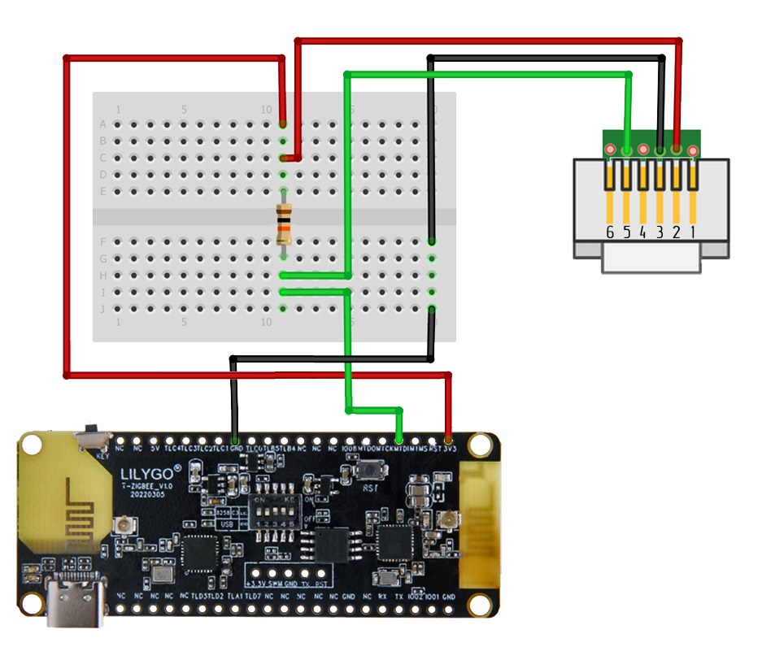
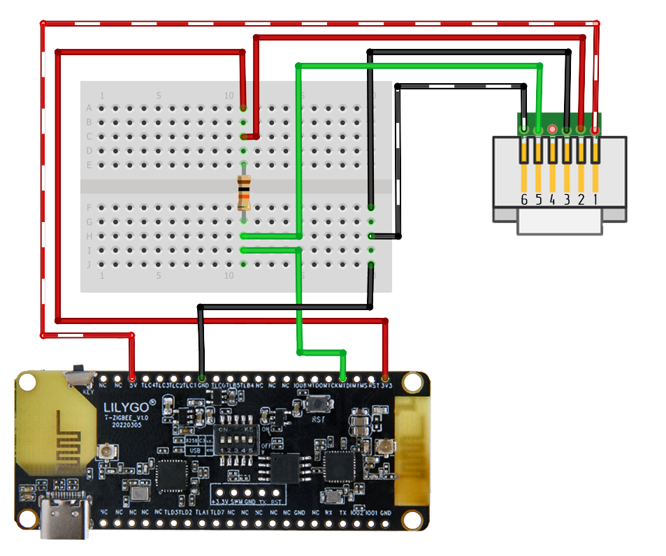
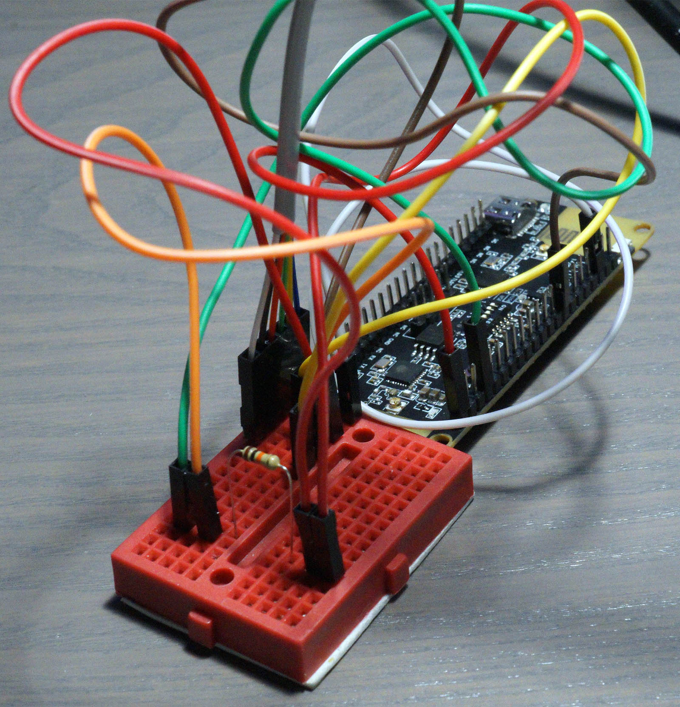
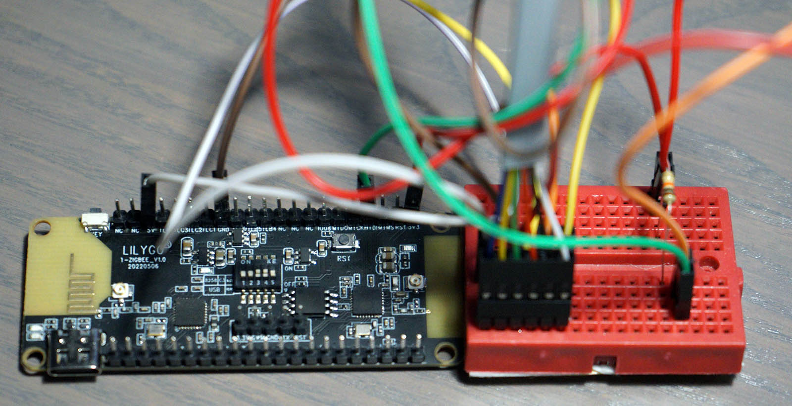
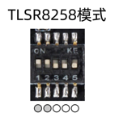
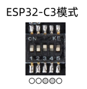

# Zigbee P1 Energy Meter Reader

## Description
Zigbee P1 energy meter software for  [LilyGO T-Zigbee board](https://www.lilygo.cc/products/t-zigbee-esp32-c3-tlsr8258 )

## Background
There are many repositories on web with various solution for reading data from energy meter through P1 port but most of the are using WIFI for it. Since meter in my situation is quite far away from router and I have quite good Zigbee network already, I've decided to develop my own variant of P1 reader using [LilyGO T-Zigbee board](https://www.lilygo.cc/products/t-zigbee-esp32-c3-tlsr8258 ).  

As a base for this project, I've used examples from LilyGo Github and [esp32_p1meter](https://github.com/bartwo/esp32_p1meter)  repostiory by [bartwo](https://github.com/bartwo)

I kept WIFI module off on purpose to reduce power use but that also means, that this device doesn't have OTA capabilities like many other ESP32 projects.
I've tested it on `ISKRA AM550 ED-1` on signle phase power meter so part of the code responsible for L1-3 power are commented out. I've also tried to minimaze amount of data is transmitted via Zigbee so there is also no reporting on how much data was delivered, voltage or current - this should be quite easy to add though.

## Hardware Required

- [LilyGO T-Zigbee board](https://www.lilygo.cc/products/t-zigbee-esp32-c3-tlsr8258 ).
- U2T programmer
- A 10k ohm resistor
- A 4 pin (RJ11) or [6 pin (RJ12) cable](https://www.tinytronics.nl/shop/nl/kabels/adapters/rj12-naar-6-pins-dupont-jumper-adapter) shorter than 3 meters. Both cables work great, but a 6 pin cable can also power the ESP32 on most DSMR5+ meters.

## Software Required
I was not able to compile LilyGO examples in ArduinoIDE so using PlatformIO is sort of mandatory
* [VS Code](https://code.visualstudio.com/) with [PlatformIO](https://platformio.org/) addon installed

## Setup

### Circuit diagram
_Note: I have only tested this on the `ISKRA AM550 ED-1`._
T Zigbee board contains two hardware serials although second one is not usable if TLSR8258 Zigbee module is activated.  Because of that, first hardware serial is used which means debugging capatibilities are sort of limited to reading of messages from serial port. 

*For testing purposes it is also possible to enable DEBUG_SERIAL in settings.h file - this will allow you to type some test input via Serial Monitor.*

Connect the ESP32 to an RJ11 cable/connector following the diagram. Ignore line 1 & 6 if you do not intend to power your board from the meter.

| P1 pin   | ESP32 Pin |
| ----     | ---- |
| 2 - RTS  | 3.3v |
| 3 - GND  | GND  |
| 4 -      |      |
| 5 - RXD (data) | GPIO05 |

RXD data pin can be adjusted by modyfing SERIAL_PIN_RX define in settings.h file.

On most models a 10K resistor should be used between the ESP's 3.3v and the p1's DATA (RXD) pin. Many howto's mention RTS requires 5V (VIN) to activate the P1 port, but for me 3V3 suffices.

Optional: Powering the T-Zigbee using your DSMR5+ meter

When using a 6 pin cable you can use the power source provided by the meter.
  

| P1 pin   | ESP32 Pin |
| ----     | ---- |
| 1 - 5v out | 5v or Vin |
| 2 - RTS  | 3.3v |
| 3 - GND  | GND  |
| 4 -      |      |
| 5 - RXD (data) | GPIO05 |
| 6 - GND  | GND  |

End result

### Update Firmware
Before going any further, make sure that TLSR8258 is flashed with correct firmware, to do so

Adjust the DIP switch:

Change firmware on TLSR8258 to [hciDevice_ZR_8258_SDK_eb644f1_MD5_3e7c395bacca28475952808a79ff2ec1.bin](../../firmware/hciDevice_ZR_8258_SDK_eb644f1_MD5_3e7c395bacca28475952808a79ff2ec1.bin)
using instructions mentioned in [official documentation](https://zbhci.readthedocs.io/en/latest/user-guide/burning.html)

### Upload Sketch

Adjust the DIP switch:

After that, you can open project in Visual Studio Code using PlatformIO and then build and upload  [p1_reader.ino](/p1_meter/p1_reader.ino) sketch to ESP32.

## Pairing process

### 1. Install custom converter 
Add this external converter [lilygo_sensor.js](./lilygo_sensor.js) to Zigbee2MQTT config directory as to [this procedure](https://www.zigbee2mqtt.io/advanced/support-new-devices/01_support_new_devices.html#instructions)

### 2. Permit join

Zigbee2MQTT addon has a built-in webbased frontend. You can pair the device by clicking permit join button on the web before above pairing action on the board.
    

### 3. Pair board
Hold side button for more than 3 seconds to initiate pairing process. 
*Hold button actions also alows you to leave Zigbee network*

## Thanks to
* https://github.com/bartwo/esp32_p1meter
- https://github.com/fliphess/esp8266_p1meter
- https://github.com/jantenhove/P1-Meter-ESP8266
- https://github.com/neographikal/P1-Meter-ESP8266-MQTT
- http://gejanssen.com/howto/Slimme-meter-uitlezen/
- https://github.com/rroethof/p1reader/
- http://romix.macuser.nl/software.html
- http://blog.regout.info/category/slimmeter/
- http://domoticx.com/p1-poort-slimme-meter-hardware/
- [https://github.com/daniel-jong/esp8266_p1meter](https://github.com/daniel-jong/esp8266_p1meter)
- [https://github.com/WhoSayIn/esp8266_dsmr2mqtt](https://github.com/WhoSayIn/esp8266_dsmr2mqtt)
- [https://github.com/jhockx/esp8266_p1meter](https://github.com/jhockx/esp8266_p1meter)

Other sources:
- [DSMR 5.0 documentation](https://www.netbeheernederland.nl/_upload/Files/Slimme_meter_15_a727fce1f1.pdf)
